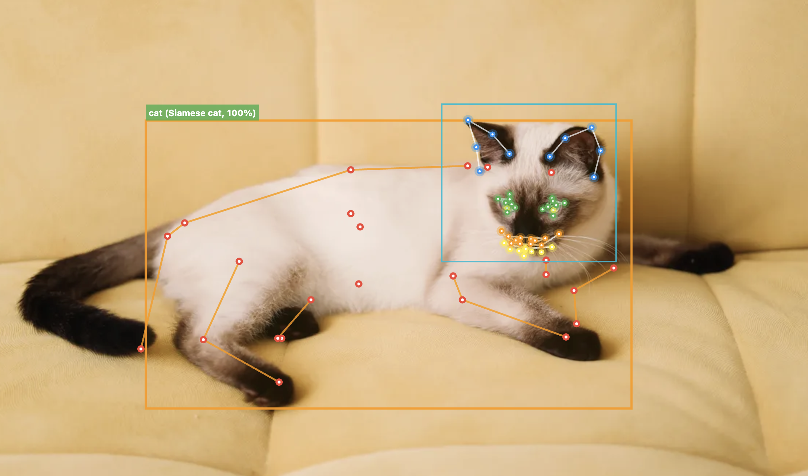

<h1 align="center">cat_detection</h1>

<p align="center">
<a href="https://flutter.dev"></a>
<a href="https://dart.dev"></a>
<br>
<a href="https://pub.dev/packages/cat_detection"></a>
<a href="https://pub.dev/packages/cat_detection/score"></a>
<a href="https://github.com/hugocornellier/cat_detection/blob/main/LICENSE"></a>
</p>



On-device cat detection using TFLite models. Detects cats in images with breed identification, body pose estimation, face localization, and 48-point facial landmarks — all running locally with no remote API.

## Features

- Cat body detection with bounding box (SSD-based)
- Breed identification with confidence score
- Body pose estimation via SuperAnimal keypoints
- Face localization and 48-point facial landmark extraction (CatFLW)
- Truly cross-platform: compatible with Android, iOS, macOS, Windows, and Linux
- Background isolate support via `CatDetectorIsolate` for guaranteed non-blocking UI
- Configurable performance with XNNPACK, GPU, and CoreML acceleration

## Quick Start

```dart
import 'package:cat_detection/cat_detection.dart';

final detector = CatDetector(mode: CatDetectionMode.full);
await detector.initialize();

final cats = await detector.detect(imageBytes);
for (final cat in cats) {
  print('${cat.species} at ${cat.boundingBox}');
  print('Breed: ${cat.breed} (${(cat.speciesConfidence! * 100).toStringAsFixed(0)}%)');
  print('Pose keypoints: ${cat.pose?.landmarks.length}');
  print('Face landmarks: ${cat.face?.landmarks.length}');
}

await detector.dispose();
```

## Cat Face Landmarks (48-Point)

The `landmarks` property returns a list of 48 `CatLandmark` objects representing key points on the detected cat face.

### Landmark Groups

| Group | Count | Points |
|-------|-------|--------|
| Left ear | 5 | Ear contour |
| Right ear | 5 | Ear contour |
| Left eye | 7 | Eye corners, contour, and center |
| Right eye | 7 | Eye corners, contour, and center |
| Nose bridge | 2 | Bridge left and right |
| Nose ring | 4 | Nostril outline |
| Nose tips/wings | 4 | Nose tip and wing points |
| Mouth/chin | 10 | Lips, jaw, muzzle, and chin |
| Face contour | 4 | Face outline and muzzle center |

### Accessing Landmarks

```dart
final CatFace face = cat.face!;

// Iterate through all landmarks
for (final landmark in face.landmarks) {
  print('${landmark.type.name}: (${landmark.x}, ${landmark.y})');
}
```

## Breed Identification

In `full` and `poseOnly` modes, each detected cat includes a predicted breed label and confidence score from the species classifier.

```dart
final cats = await detector.detect(imageBytes);
for (final cat in cats) {
  if (cat.breed != null) {
    print('Breed: ${cat.breed}');
    print('Confidence: ${(cat.speciesConfidence! * 100).toStringAsFixed(1)}%');
  }
}
```

## Bounding Boxes

The `boundingBox` property returns a `BoundingBox` object representing the cat body bounding box in absolute pixel coordinates.

```dart
final BoundingBox boundingBox = cat.boundingBox;

// Access edges
final double left = boundingBox.left;
final double top = boundingBox.top;
final double right = boundingBox.right;
final double bottom = boundingBox.bottom;

// Calculate dimensions
final double width = boundingBox.right - boundingBox.left;
final double height = boundingBox.bottom - boundingBox.top;

print('Box: ($left, $top) to ($right, $bottom)');
print('Size: $width x $height');
```

## Model Details

| Model | Size | Input | Purpose |
|-------|------|-------|---------|
| Face localizer | 17 MB | 224x224 | Cat face detection and bounding box |
| Landmark model (full) | 57 MB | 256x256 | 48-point facial landmark extraction |

## Configuration Options

The `CatDetector` constructor accepts several configuration options:

```dart
final detector = CatDetector(
  mode: CatDetectionMode.full,               // Detection mode
  poseModel: AnimalPoseModel.rtmpose,        // Body pose model variant
  landmarkModel: CatLandmarkModel.full,      // Face landmark model variant
  cropMargin: 0.20,                          // Margin around detected body for crop
  detThreshold: 0.5,                         // SSD detection confidence threshold
  interpreterPoolSize: 1,                    // TFLite interpreter pool size
  performanceConfig: PerformanceConfig.disabled, // Performance optimization
);
```

| Option | Type | Default | Description |
|--------|------|---------|-------------|
| `mode` | `CatDetectionMode` | `full` | Detection mode |
| `poseModel` | `AnimalPoseModel` | `rtmpose` | Body pose model variant |
| `landmarkModel` | `CatLandmarkModel` | `full` | Face landmark model variant |
| `cropMargin` | `double` | `0.20` | Margin around detected body crop (0.0-1.0) |
| `detThreshold` | `double` | `0.5` | SSD detection confidence threshold |
| `interpreterPoolSize` | `int` | `1` | TFLite interpreter pool size |
| `performanceConfig` | `PerformanceConfig` | `disabled` | Hardware acceleration config |

## Detection Modes

| Mode | Features | Speed |
|------|----------|-------|
| **full** | Body detection + breed ID + body pose + face landmarks | Standard |
| **poseOnly** | Body detection + breed ID + body pose (no face) | Faster |

## Background Isolate Detection

For applications that require guaranteed non-blocking UI, use `CatDetectorIsolate`. This runs the **entire** detection pipeline in a background isolate, ensuring all processing happens off the main thread.

```dart
import 'package:cat_detection/cat_detection.dart';

// Spawn isolate (loads models in background)
final detector = await CatDetectorIsolate.spawn(
  mode: CatDetectionMode.full,
);

// All detection runs in background isolate - UI never blocked
final cats = await detector.detectCats(imageBytes);

for (final cat in cats) {
  print('${cat.breed} at ${cat.boundingBox}');
  print('Face landmarks: ${cat.face?.landmarks.length}');
}

// Cleanup when done
await detector.dispose();
```

### When to Use CatDetectorIsolate

| Use Case | Recommended |
|----------|-------------|
| Live camera with 60fps UI requirement | `CatDetectorIsolate` |
| Processing images in a batch queue | `CatDetectorIsolate` |
| Simple single-image detection | `CatDetector` |
| Maximum control over pipeline stages | `CatDetector` |

## Performance

XNNPACK can be enabled for 2-5x CPU speedup via SIMD vectorization (NEON on ARM, AVX on x86):

```dart
final detector = CatDetector(
  performanceConfig: PerformanceConfig.xnnpack(),
);
await detector.initialize();
```
## Credits

Models trained on the [CatFLW dataset](https://github.com/catflw/catflw).

## Example

The [sample code](https://pub.dev/packages/cat_detection/example) from the pub.dev example tab includes a
Flutter app that paints detections onto an image: bounding boxes and 48-point cat facial landmarks.
