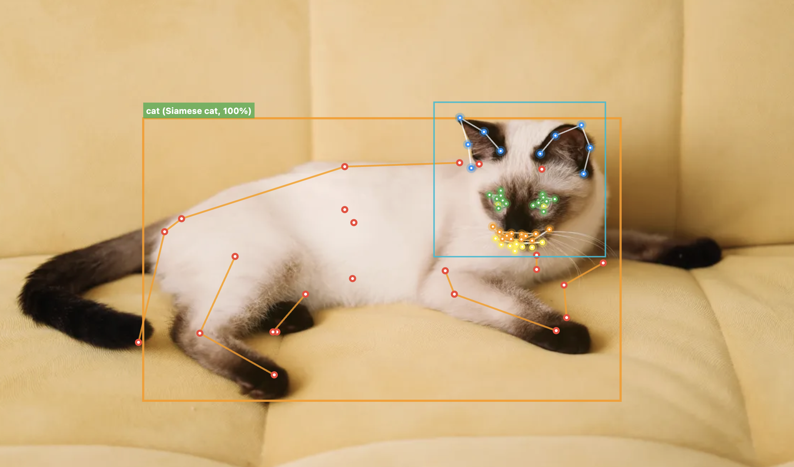

<h1 align="center">cat_detection</h1>

<p align="center">
<a href="https://flutter.dev"></a>
<a href="https://dart.dev"></a>
<br>
<a href="https://pub.dev/packages/cat_detection"></a>
<a href="https://pub.dev/packages/cat_detection/score"></a>
<a href="https://github.com/hugocornellier/cat_detection/blob/main/LICENSE"></a>
</p>



On-device cat detection using TFLite models. Detects cats in images with breed identification, body pose estimation, face localization, and 48-point facial landmarks.

## Features 

- Cat body detection with bounding box (SSD-based)
- Breed identification with confidence score
- Body pose estimation via SuperAnimal keypoints
- Face localization and 48-point facial landmark extraction (CatFLW)
- Truly cross-platform: compatible with Android, iOS, macOS, Windows, and Linux
- Configurable performance with XNNPACK, GPU, and CoreML acceleration

## Quick Start

```dart
import 'package:cat_detection/cat_detection.dart';

final detector = CatDetector(mode: CatDetectionMode.full);
await detector.initialize();

final cats = await detector.detect(imageBytes);
for (final cat in cats) {
  print('${cat.species} at ${cat.boundingBox}');
  // breed is null when the classifier landed on a near-miss class
  if (cat.breed != null) print('Breed: ${cat.breed}');
  print('Pose keypoints: ${cat.pose?.landmarks.length}');
  print('Face landmarks: ${cat.face?.landmarks.length}');
}

await detector.dispose();
```

## Cat Face Landmarks (48-Point)

The `landmarks` property returns a list of 48 `CatLandmark` objects representing key points on the detected cat face.

### Landmark Groups

| Group | Count | Points |
|-------|-------|--------|
| Left ear | 5 | Ear contour |
| Right ear | 5 | Ear contour |
| Left eye | 7 | Eye corners, contour, and center |
| Right eye | 7 | Eye corners, contour, and center |
| Nose bridge | 2 | Bridge left and right |
| Nose ring | 4 | Nostril outline |
| Nose tips/wings | 4 | Nose tip and wing points |
| Mouth/chin | 10 | Lips, jaw, muzzle, and chin |
| Face contour | 4 | Face outline and muzzle center |

### Accessing Landmarks

```dart
final CatFace face = cat.face!;

// Iterate through all landmarks
for (final landmark in face.landmarks) {
  print('${landmark.type.name}: (${landmark.x}, ${landmark.y})');
}
```

## Species Filtering

Only cats are returned. In `full` and `poseOnly` modes the species classifier's
label is checked before a result is emitted, and any animal identified as
something else is dropped. A `Cat` that is not a cat would break the guarantee
its own type makes, so an image containing other animals yields only the cats.

If you want every animal regardless of species, use
[animal_detection](https://pub.dev/packages/animal_detection) directly. It is
already a dependency of this package.

`minSpeciesConfidence` adds an optional second filter on classifier confidence:

```dart
final detector = CatDetector(minSpeciesConfidence: 0.35);
```

It defaults to `0.0`, meaning off, and is worth raising if you see confident
misidentifications. People are the common case, because the underlying
1000-class ImageNet classifier has no person category and must assign every crop
to some animal or object class. Note the value is not comparable with the
sibling package's: it is one class's softmax probability, and probability mass
splits across however many classes a species occupies.

`faceOnly` mode is unaffected. It runs no classifier, so there is no species to
check, and the caller has already asserted the subject.

## Breed Identification

In `full` and `poseOnly` modes, each detected cat may include a predicted breed
label and confidence score from the species classifier.

`breed` is null when no breed is known: in `faceOnly` mode, which runs no
classifier, or when the classifier's top class fell in the near-miss block
(cougar or lynx). Those are still returned as cats, since the likeliest explanation is a
domestic cat placed on a neighbouring class, but the label is withheld rather
than naming an animal the subject probably is not. Always null-check it.

```dart
final cats = await detector.detect(imageBytes);
for (final cat in cats) {
  if (cat.breed != null) {
    print('Breed: ${cat.breed}');
    print('Confidence: ${(cat.speciesConfidence! * 100).toStringAsFixed(1)}%');
  }
}
```

## Bounding Boxes

The `boundingBox` property returns a `BoundingBox` object representing the cat body bounding box in absolute pixel coordinates.

```dart
final BoundingBox boundingBox = cat.boundingBox;

// Access edges
final double left = boundingBox.left;
final double top = boundingBox.top;
final double right = boundingBox.right;
final double bottom = boundingBox.bottom;

// Calculate dimensions
final double width = boundingBox.right - boundingBox.left;
final double height = boundingBox.bottom - boundingBox.top;

print('Box: ($left, $top) to ($right, $bottom)');
print('Size: $width x $height');
```

## Model Details

| Model | Size | Input | Purpose |
|-------|------|-------|---------|
| Face localizer | 17 MB | 224x224 | Cat face detection and bounding box |
| Landmark model (full) | 11 MB | 384x384 | 48-point facial landmark extraction |

## Configuration Options

The `CatDetector` constructor accepts several configuration options:

```dart
final detector = CatDetector(
  mode: CatDetectionMode.full,               // Detection mode
  poseModel: AnimalPoseModel.rtmpose,        // Body pose model variant
  landmarkModel: CatLandmarkModel.full,      // Face landmark model variant
  cropMargin: 0.20,                          // Margin around detected body for crop
  detThreshold: 0.5,                         // SSD detection confidence threshold
  interpreterPoolSize: 1,                    // TFLite interpreter pool size
  performanceConfig: const PerformanceConfig(), // Auto acceleration
);
```

| Option | Type | Default | Description |
|--------|------|---------|-------------|
| `mode` | `CatDetectionMode` | `full` | Detection mode |
| `poseModel` | `AnimalPoseModel` | `rtmpose` | Body pose model variant |
| `landmarkModel` | `CatLandmarkModel` | `full` | Face landmark model variant |
| `cropMargin` | `double` | `0.20` | Margin around detected body crop (0.0-1.0) |
| `detThreshold` | `double` | `0.5` | SSD detection confidence threshold |
| `interpreterPoolSize` | `int` | `1` | TFLite interpreter pool size |
| `performanceConfig` | `PerformanceConfig` | `auto` | Interpreter hardware acceleration config |

## Detection Modes

| Mode | Features | Speed |
|------|----------|-------|
| **full** | Body detection + breed ID + body pose + face landmarks | Standard |
| **poseOnly** | Body detection + breed ID + body pose (no face) | Faster |

## Background Isolate Detection

Detection always runs in a background isolate. `CatDetector` spawns and owns that
isolate during `initialize()`, so the whole pipeline (decode, SSD, species, pose,
localizer, landmarks) stays off the main thread and the UI is never blocked.
There is nothing extra to opt into:

```dart
import 'package:cat_detection/cat_detection.dart';

// initialize() loads the models and spawns the worker isolate
final detector = CatDetector(mode: CatDetectionMode.full);
await detector.initialize();

// Runs in the background isolate; the UI thread stays free
final cats = await detector.detect(imageBytes);

for (final cat in cats) {
  print('${cat.breed} at ${cat.boundingBox}');
  print('Face landmarks: ${cat.face?.landmarks.length}');
}

// Tears down the isolate and frees the native interpreters
await detector.dispose();
```

Model bytes are transferred into the isolate with `TransferableTypedData`, so the
~70MB of weights in the default configuration move without being copied.

## Requirements

- Dart 3.10+ and Flutter 3.47.5+ (`dartcv4 2.3.1` needs `meta 1.19.0`, which
  older `flutter_test` pins rule out).
- iOS builds on Xcode 27 need an iOS 15 deployment target. Set the Runner
  target (and `platform :ios` in `ios/Podfile`) to 15.0 or newer, add the block
  below to your app's `pubspec.yaml`, then run `flutter clean`:

  ```yaml
  hooks:
    user_defines:
      dartcv4:
        ios:
          deployment_target: '15.0'
  ```

  This has to live in the app: Dart only reads hook user-defines from the root
  package, so `cat_detection` cannot set it for you.

## Performance

### Hardware Acceleration

The package automatically selects the best acceleration strategy for each platform:

| Platform | Default Delegate | Speedup | Notes |
|----------|-----------------|---------|-------|
| **macOS** | XNNPACK | 2-5x | SIMD vectorization (NEON on ARM, AVX on x86) |
| **Linux** | XNNPACK | 2-5x | SIMD vectorization |
| **iOS** | Metal GPU | 2-4x | Hardware GPU acceleration |
| **Android** | XNNPACK | 2-5x | ARM NEON SIMD acceleration |
| **Windows** | XNNPACK | 2-5x | SIMD vectorization (AVX on x86) |

No configuration needed, just call `initialize()` and you get the optimal performance for your platform.

### Advanced Performance Configuration

```dart
// Auto mode (default), optimal for each platform
await detector.initialize();

// Force XNNPACK (all native platforms)
final detector = CatDetector(
  performanceConfig: PerformanceConfig.xnnpack(numThreads: 4),
);
await detector.initialize();

// Force GPU delegate (iOS recommended, Android experimental)
final detector = CatDetector(
  performanceConfig: PerformanceConfig.gpu(),
);
await detector.initialize();

// CPU-only (maximum compatibility)
final detector = CatDetector(
  performanceConfig: PerformanceConfig.disabled,
);
await detector.initialize();
```

### LiteRT Next CompiledModel

CompiledModel is opt-in and covers the active body, classification, pose,
face-localizer, and face-landmark stages:

```dart
// Try GPU first, with verified CPU/stage fallback.
await detector.initialize(useCompiledModel: true);

// Pin CompiledModel to CPU.
await detector.initialize(
  useCompiledModel: true,
  accelerators: {Accelerator.cpu},
);
```

Every requested compiled graph is compared with a plain-CPU Interpreter before
use. A numerically unsafe GPU graph retries on CompiledModel CPU; if that also
fails, only that stage uses Interpreter. Interpreter remains the default and
`Precision.fp32` is used unless explicitly overridden.

## Live Camera Detection

For real-time detection, pass each `camera` package image directly to the
detector. Packing happens on the caller, while color conversion, rotation,
downscaling, and inference stay in the detector worker isolate.

```dart
final cats = await detector.detectFromCameraImage(
  cameraImage,
  rotation: rotation,
  isBgra: Platform.isMacOS,
  maxDim: 640,
);
```

For lower-level integrations, use `prepareCameraFrame(...)` followed by
`detectFromCameraFrame(...)`.

## Credits

Models trained on the [CatFLW dataset](https://github.com/martvelge/CatFLW) by
Martvel et al., Tech4Animals Lab, University of Haifa.

CatFLW is licensed
[CC BY-NC 4.0](https://creativecommons.org/licenses/by-nc/4.0/). The dataset
itself is not redistributed here; obtain it from
[Kaggle](https://www.kaggle.com/datasets/georgemartvel/catflw) under its own
terms.

```bibtex
@article{martvel2023catflw,
  title={Catflw: Cat facial landmarks in the wild dataset},
  author={Martvel, George and Farhat, Nareed and Shimshoni, Ilan and Zamansky, Anna},
  journal={arXiv preprint arXiv:2305.04232},
  year={2023}
}

@article{martvel2024automated,
  title={Automated Detection of Cat Facial Landmarks},
  author={Martvel, George and Shimshoni, Ilan and Zamansky, Anna},
  journal={International Journal of Computer Vision},
  pages={1--16},
  year={2024},
  publisher={Springer}
}
```

## Weights and training code

The models in this package are published separately, with the full training
pipeline that produced them:

- **Weights:** [huggingface.co/hugocornellier/cat-face-landmarks](https://huggingface.co/hugocornellier/cat-face-landmarks)
  also carries a higher-accuracy variant (3.27 NME_IOD against 3.48 for the
  bundled one) that is too slow for phones but better suited to server-side use.
- **Training code and experiment journal:**
  [github.com/hugocornellier/cat-face-landmarks-training](https://github.com/hugocornellier/cat-face-landmarks-training)

## License

The Dart source code is **MIT**; see [`LICENSE`](LICENSE).

**The bundled model files are an exception.**
`assets/models/cat_face_landmarks_full.tflite` and
`assets/models/cat_face_localizer.tflite` are licensed
[**CC BY-NC 4.0**](https://creativecommons.org/licenses/by-nc/4.0/),
**non-commercial use only**. See [`NOTICE`](NOTICE).

This means using this package in a commercial product is not something this
license permits, because doing so runs those weights. The Dart code stays
MIT and can be used commercially with weights you supply yourself.

The reason is that the weights are trained on CatFLW, which is CC BY-NC 4.0. Its
authors were asked directly how they wanted derived weights licensed, asked for
CC BY-NC 4.0 to stay consistent with the dataset, and granted permission to
publish on that basis. Commercial permission is not this package author's alone
to give: for that, contact the dataset authors at the Tech4Animals Lab,
University of Haifa.

## Example

The [sample code](https://pub.dev/packages/cat_detection/example) includes
matching live-camera, still-image, and video-file demos. All three paint body
pose and 48-point face landmarks; video output uses temporal smoothing and can
be replayed in the app.
